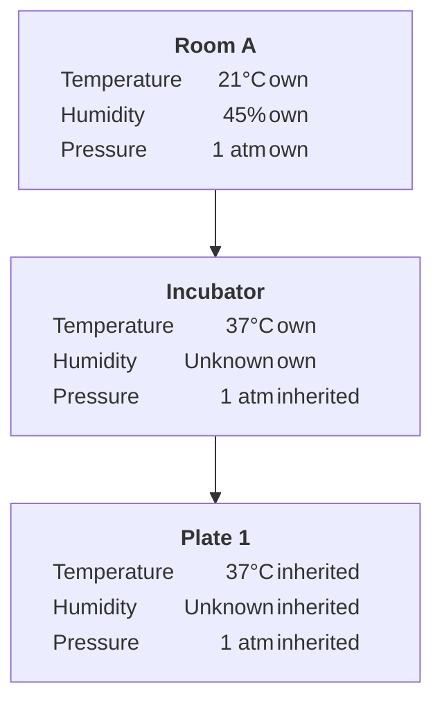

# Environmental Attributes & Inheritance

A location doesn't just have a position in the hierarchy -- it has an environment (temperature,
humidity, ...), and that environment flows down the hierarchy the same way physical containment
does.

A `Room` containing an `Incubator` containing the running `plate` gives this chapter somewhere to
set attributes:

```julia
@location_kind Room Symbol[] nothing nothing nothing nothing nothing 0//1 0//1
@location_kind Incubator Symbol[] nothing nothing nothing nothing nothing 2//1 0//1
set_occupancy_cost!(:Incubator, :WP96, 1//4)
```

```julia-repl
julia> room = build_location(loc"Room", "Room A")
Room A

julia> incubator = build_location(loc"Incubator", "Incubator")
Incubator

julia> plate = build_location(loc"WP96", "Plate 1")
Plate 1

julia> move_into!(room, incubator)

julia> move_into!(incubator, plate)
```

## Defining new attribute kinds

A location's environment is made up of attribute kinds, which can be defined and registered with the [`@attribute`](@ref) macro. 
Attribute kinds are registered the same way location kinds are: a `const` binding plus a registry
entry, recalled collision-safely by name.

```julia
@attribute Temperature u"°C"
@attribute Humidity u"percent"
@attribute BarometricPressure u"atm"
```

```julia-repl
julia> attr"Temperature"
AttributeKind(Temperature)
```

## A location's own attributes

[`set_attribute!(loc, attribute)`](@ref) sets a location's own attribute; [`attributes(x)`](@ref)
reads that own set back.

```julia-repl
julia> set_attribute!(room, Temperature(21u"°C"))

julia> attributes(room)
Dict{Symbol, Attribute} with 1 entry:
  :Temperature => 21.0 °C
```

## Environment: attributes are inherited

[`environment(x)`](@ref) is the inherited view: `x`'s own attributes override its parent's
environment, recursively. A location with no attributes of its own just inherits its parent's:


Consider a `Room` containing an `Incubator` containing `plate`, with `Room` setting `Temperature`,
`Humidity`, and `BarometricPressure`. `Incubator` overrides `Temperature` with a real value and
`Humidity` with [`Unknown`](@ref) instead -- an actively indeterminate reading (a broken sensor,
say), as opposed to `missing`'s "no local opinion." `plate` inherits from `Incubator`:

```julia-repl
julia> environment(plate)
Dict{Symbol, Attribute} with 3 entries:
  :Temperature        => 37.0 °C
  :Humidity           => Unknown
  :BarometricPressure => 1.0 atm
```



Each attribute takes a different path down the chain: `BarometricPressure` is set once at `Room` and
never touched again -- pure inheritance, unchanged two hops to `Plate`. `Temperature` is set at
`Room`, overridden with a real value at `Incubator`, then inherited unchanged from there to `Plate`.
`Humidity` is set at `Room`, then overridden with `Unknown` at `Incubator` -- which propagates to
`Plate` just like a real value would, rather than being skipped. `Plate` itself has nothing of its
own; every one of its values is inherited.

A `missing` value means "no local opinion" -- it clears `incubator`'s own `Temperature` and falls
back to what `incubator` itself inherits from `room`:

```julia-repl
julia> set_attribute!(incubator, Temperature(missing))

julia> environment(plate)
Dict{Symbol, Attribute} with 3 entries:
  :Temperature        => 21.0 °C
  :Humidity           => Unknown
  :BarometricPressure => 1.0 atm
```

Movement and attributes together cover rearranging the hierarchy and tracking each location's
environment. [Stocks & Chemistry](stocks.md) covers putting material into wells -- chemicals,
reagents, stocks, and transfers.
