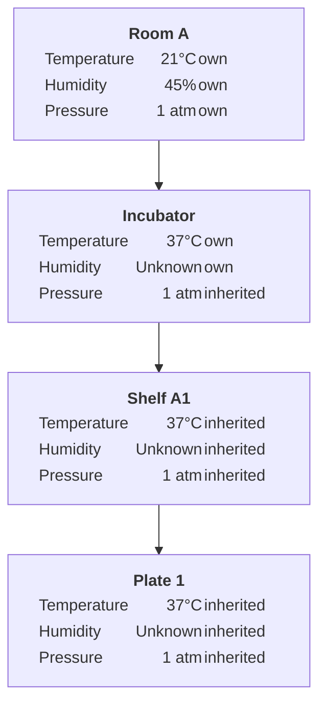

# Environmental Attributes & Inheritance

```@meta
DocTestSetup = :(using CHESS)
```

A location doesn't just have a position in the hierarchy -- it has an environment (temperature,
humidity, ...), and that environment flows down the hierarchy the same way physical containment
does.

This chapter uses a room holding CHESS's `Incubator`, which has three shelves, with a plate on the
first shelf:

```jldoctest attributes
julia> room = build_location(loc"Room", "Room A");

julia> incubator = build_location(loc"Incubator", "Incubator");

julia> shelf = incubator[1];

julia> plate = build_location(loc"WP96", "Plate 1");

julia> move_into!(room, incubator)

julia> move_into!(shelf, plate)
```

## Defining new attribute kinds

A location's environment is made up of attribute kinds, which are defined and registered with the
[`@attribute`](@ref) macro. Attribute kinds are registered the same way location kinds are: a
`const` binding plus a registry entry, recalled collision-safely by name. `using CHESS` already
registers common kinds such as `Temperature` and `Humidity`, so this example registers a new one:

```jldoctest attributes
julia> @attribute BarometricPressure u"atm"
AttributeKind(BarometricPressure)
```

Registered kinds are recalled with [`@attr_str`](@ref):

```jldoctest attributes
julia> attr"Temperature"
AttributeKind(Temperature)
```

## A location's own attributes

Calling an attribute kind with a value creates an attribute.
[`set_attribute!(loc, attribute)`](@ref) sets a location's own attribute, and
[`attributes(x)`](@ref) reads that own set back.

```jldoctest attributes
julia> set_attribute!(room, attr"Temperature"(21u"°C"))

julia> attributes(room)
Dict{Symbol, Attribute} with 1 entry:
  :Temperature => 21.0 °C
```

## Environment: attributes are inherited

[`environment(x)`](@ref) is the inherited view: `x`'s own attributes override its parent's
environment, recursively. A location with no attributes of its own just inherits its parent's.

Here `room` also sets `Humidity` and `BarometricPressure`. The incubator overrides `Temperature`
with a real value and `Humidity` with [`Unknown`](@ref): an actively indeterminate reading (a broken
sensor, say), as opposed to `missing`'s "no local opinion." The shelf and the plate set nothing of
their own:

```jldoctest attributes
julia> set_attribute!(room, attr"Humidity"(45u"percent"))

julia> set_attribute!(room, BarometricPressure(1u"atm"))

julia> set_attribute!(incubator, attr"Temperature"(37u"°C"))

julia> set_attribute!(incubator, attr"Humidity"(Unknown))

julia> environment(plate)
Dict{Symbol, Attribute} with 3 entries:
  :Humidity           => Unknown
  :Temperature        => 37.0 °C
  :BarometricPressure => 1.0 atm
```


```mermaid
graph TD
    Room["<div style='text-align:center'><b>Room A</b></div><table style='border-collapse:collapse'><tr><td style='text-align:left;color:#2563eb;min-width:95px;white-space:nowrap'>Temperature</td><td style='text-align:right;color:#2563eb;min-width:55px;white-space:nowrap'>21°C</td><td style='text-align:left;color:#2563eb;min-width:75px;white-space:nowrap'>own</td></tr><tr><td style='text-align:left;color:#2563eb;white-space:nowrap'>Humidity</td><td style='text-align:right;color:#2563eb;white-space:nowrap'>45%</td><td style='text-align:left;color:#2563eb;white-space:nowrap'>own</td></tr><tr><td style='text-align:left;color:#2563eb;white-space:nowrap'>Pressure</td><td style='text-align:right;color:#2563eb;white-space:nowrap'>1 atm</td><td style='text-align:left;color:#2563eb;white-space:nowrap'>own</td></tr></table>"]
    Incubator["<div style='text-align:center'><b>Incubator</b></div><table style='border-collapse:collapse'><tr><td style='text-align:left;color:#2563eb;min-width:95px;white-space:nowrap'>Temperature</td><td style='text-align:right;color:#2563eb;min-width:55px;white-space:nowrap'>37°C</td><td style='text-align:left;color:#2563eb;min-width:75px;white-space:nowrap'>own</td></tr><tr><td style='text-align:left;color:#2563eb;white-space:nowrap'>Humidity</td><td style='text-align:right;color:#2563eb;white-space:nowrap'>Unknown</td><td style='text-align:left;color:#2563eb;white-space:nowrap'>own</td></tr><tr><td style='text-align:left;color:#6b7280;white-space:nowrap'>Pressure</td><td style='text-align:right;color:#6b7280;white-space:nowrap'>1 atm</td><td style='text-align:left;color:#6b7280;white-space:nowrap'>inherited</td></tr></table>"]
    Shelf["<div style='text-align:center'><b>Shelf A1</b></div><table style='border-collapse:collapse'><tr><td style='text-align:left;color:#6b7280;min-width:95px;white-space:nowrap'>Temperature</td><td style='text-align:right;color:#6b7280;min-width:55px;white-space:nowrap'>37°C</td><td style='text-align:left;color:#6b7280;min-width:75px;white-space:nowrap'>inherited</td></tr><tr><td style='text-align:left;color:#6b7280;white-space:nowrap'>Humidity</td><td style='text-align:right;color:#6b7280;white-space:nowrap'>Unknown</td><td style='text-align:left;color:#6b7280;white-space:nowrap'>inherited</td></tr><tr><td style='text-align:left;color:#6b7280;white-space:nowrap'>Pressure</td><td style='text-align:right;color:#6b7280;white-space:nowrap'>1 atm</td><td style='text-align:left;color:#6b7280;white-space:nowrap'>inherited</td></tr></table>"]
    Plate["<div style='text-align:center'><b>Plate 1</b></div><table style='border-collapse:collapse'><tr><td style='text-align:left;color:#6b7280;min-width:95px;white-space:nowrap'>Temperature</td><td style='text-align:right;color:#6b7280;min-width:55px;white-space:nowrap'>37°C</td><td style='text-align:left;color:#6b7280;min-width:75px;white-space:nowrap'>inherited</td></tr><tr><td style='text-align:left;color:#6b7280;white-space:nowrap'>Humidity</td><td style='text-align:right;color:#6b7280;white-space:nowrap'>Unknown</td><td style='text-align:left;color:#6b7280;white-space:nowrap'>inherited</td></tr><tr><td style='text-align:left;color:#6b7280;white-space:nowrap'>Pressure</td><td style='text-align:right;color:#6b7280;white-space:nowrap'>1 atm</td><td style='text-align:left;color:#6b7280;white-space:nowrap'>inherited</td></tr></table>"]
    Room --> Incubator --> Shelf --> Plate
```

Each attribute takes a different path down the chain: `BarometricPressure` is set once at the room
and never touched again -- pure inheritance, unchanged three levels down to the plate.
`Temperature` is set at the room, overridden with a real value at the incubator, then inherited
unchanged from there. `Humidity` is set at the room, then overridden with `Unknown` at the
incubator -- which propagates to the plate just like a real value would, rather than being
skipped. The plate itself has nothing of its own; every one of its values is inherited.

A `missing` value means "no local opinion" -- it clears the incubator's own `Temperature` and falls
back to what the incubator itself inherits from the room:

```jldoctest attributes
julia> set_attribute!(incubator, attr"Temperature"(missing))

julia> environment(plate)
Dict{Symbol, Attribute} with 3 entries:
  :Humidity           => Unknown
  :Temperature        => 21.0 °C
  :BarometricPressure => 1.0 atm
```

Movement and attributes together cover rearranging the hierarchy and tracking each location's
environment. [Stocks & Chemistry](stocks.md) covers putting material into wells -- chemicals,
reagents, stocks, and transfers.
