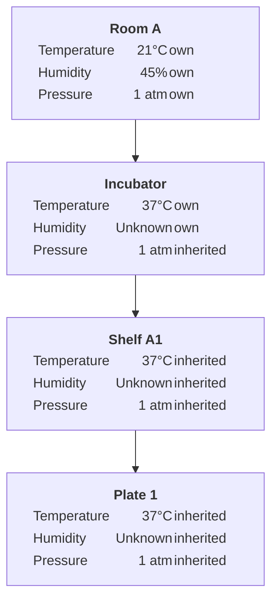

# Environmental Attributes & Inheritance

```@meta
DocTestSetup = :(using CHESS)
```

A location has an environment (temperature, humidity, and so on) as well as a place in the
hierarchy. The environment flows down the hierarchy the way physical containment does.

The examples on this page use a room holding CHESS's `Incubator`, which has three shelves, with a
plate on the first shelf:

```jldoctest attributes
julia> room = build_location(loc"Room", "Room A");

julia> incubator = build_location(loc"Incubator", "Incubator");

julia> shelf = incubator[1];

julia> plate = build_location(loc"WP96", "Plate 1");

julia> move_into!(room, incubator)

julia> move_into!(shelf, plate)
```

## Defining new attribute kinds

A location's environment is made up of attribute kinds, registered with the [`@attribute`](@ref)
macro. Like location kinds, each is a named constant plus a registry entry, recalled by name.
CHESS already includes common kinds such as `Temperature` and `Humidity`, so this example defines a
new one:

```jldoctest attributes
julia> @attribute BarometricPressure u"atm"
AttributeKind(BarometricPressure)
```

Registered kinds are recalled with [`@attr_str`](@ref):

```jldoctest attributes
julia> attr"Temperature"
AttributeKind(Temperature)
```

## A location's own attributes

Calling an attribute kind with a value creates an attribute.
[`set_attribute!(loc, attribute)`](@ref) sets a location's own attribute, and
[`attributes(x)`](@ref) reads that own set back.

```jldoctest attributes
julia> set_attribute!(room, attr"Temperature"(21u"°C"))

julia> attributes(room)
Dict{Symbol, Attribute} with 1 entry:
  :Temperature => 21.0 °C
```

## Inherited environment

[`environment(x)`](@ref) is the inherited view: `x`'s own attributes override its parent's
environment, recursively. A location with no attributes of its own just inherits its parent's.

Here the room also sets `Humidity` and `BarometricPressure`. The incubator overrides `Temperature`
with a value and `Humidity` with [`Unknown`](@ref), an indeterminate reading such as a broken
sensor produces. `Unknown` differs from `missing`, which means no local value. The shelf and the
plate set nothing:

```jldoctest attributes
julia> set_attribute!(room, attr"Humidity"(45u"percent"))

julia> set_attribute!(room, BarometricPressure(1u"atm"))

julia> set_attribute!(incubator, attr"Temperature"(37u"°C"))

julia> set_attribute!(incubator, attr"Humidity"(Unknown))

julia> environment(plate)
Dict{Symbol, Attribute} with 3 entries:
  :Humidity           => Unknown
  :Temperature        => 37.0 °C
  :BarometricPressure => 1.0 atm
```


```mermaid
graph TD
    Room["<div style='text-align:center'><b>Room A</b></div><table style='border-collapse:collapse'><tr><td style='text-align:left;color:#2563eb;min-width:95px;white-space:nowrap'>Temperature</td><td style='text-align:right;color:#2563eb;min-width:55px;white-space:nowrap'>21°C</td><td style='text-align:left;color:#2563eb;min-width:75px;white-space:nowrap'>own</td></tr><tr><td style='text-align:left;color:#2563eb;white-space:nowrap'>Humidity</td><td style='text-align:right;color:#2563eb;white-space:nowrap'>45%</td><td style='text-align:left;color:#2563eb;white-space:nowrap'>own</td></tr><tr><td style='text-align:left;color:#2563eb;white-space:nowrap'>Pressure</td><td style='text-align:right;color:#2563eb;white-space:nowrap'>1 atm</td><td style='text-align:left;color:#2563eb;white-space:nowrap'>own</td></tr></table>"]
    Incubator["<div style='text-align:center'><b>Incubator</b></div><table style='border-collapse:collapse'><tr><td style='text-align:left;color:#2563eb;min-width:95px;white-space:nowrap'>Temperature</td><td style='text-align:right;color:#2563eb;min-width:55px;white-space:nowrap'>37°C</td><td style='text-align:left;color:#2563eb;min-width:75px;white-space:nowrap'>own</td></tr><tr><td style='text-align:left;color:#2563eb;white-space:nowrap'>Humidity</td><td style='text-align:right;color:#2563eb;white-space:nowrap'>Unknown</td><td style='text-align:left;color:#2563eb;white-space:nowrap'>own</td></tr><tr><td style='text-align:left;color:#6b7280;white-space:nowrap'>Pressure</td><td style='text-align:right;color:#6b7280;white-space:nowrap'>1 atm</td><td style='text-align:left;color:#6b7280;white-space:nowrap'>inherited</td></tr></table>"]
    Shelf["<div style='text-align:center'><b>Shelf A1</b></div><table style='border-collapse:collapse'><tr><td style='text-align:left;color:#6b7280;min-width:95px;white-space:nowrap'>Temperature</td><td style='text-align:right;color:#6b7280;min-width:55px;white-space:nowrap'>37°C</td><td style='text-align:left;color:#6b7280;min-width:75px;white-space:nowrap'>inherited</td></tr><tr><td style='text-align:left;color:#6b7280;white-space:nowrap'>Humidity</td><td style='text-align:right;color:#6b7280;white-space:nowrap'>Unknown</td><td style='text-align:left;color:#6b7280;white-space:nowrap'>inherited</td></tr><tr><td style='text-align:left;color:#6b7280;white-space:nowrap'>Pressure</td><td style='text-align:right;color:#6b7280;white-space:nowrap'>1 atm</td><td style='text-align:left;color:#6b7280;white-space:nowrap'>inherited</td></tr></table>"]
    Plate["<div style='text-align:center'><b>Plate 1</b></div><table style='border-collapse:collapse'><tr><td style='text-align:left;color:#6b7280;min-width:95px;white-space:nowrap'>Temperature</td><td style='text-align:right;color:#6b7280;min-width:55px;white-space:nowrap'>37°C</td><td style='text-align:left;color:#6b7280;min-width:75px;white-space:nowrap'>inherited</td></tr><tr><td style='text-align:left;color:#6b7280;white-space:nowrap'>Humidity</td><td style='text-align:right;color:#6b7280;white-space:nowrap'>Unknown</td><td style='text-align:left;color:#6b7280;white-space:nowrap'>inherited</td></tr><tr><td style='text-align:left;color:#6b7280;white-space:nowrap'>Pressure</td><td style='text-align:right;color:#6b7280;white-space:nowrap'>1 atm</td><td style='text-align:left;color:#6b7280;white-space:nowrap'>inherited</td></tr></table>"]
    Room --> Incubator --> Shelf --> Plate
```

Each attribute takes a different path down the chain:

- `BarometricPressure` is set at the room and inherited unchanged by the plate.
- `Temperature` is set at the room, overridden at the incubator, and inherited from there.
- `Humidity` is set at the room and overridden with `Unknown` at the incubator. `Unknown`
  propagates to the plate like any other value.

The plate has no attributes of its own, so all of its values are inherited.

Setting an attribute to `missing` clears the location's own value, so the location falls back to
what it inherits. Here the incubator's `Temperature` falls back to the room's:

```jldoctest attributes
julia> set_attribute!(incubator, attr"Temperature"(missing))

julia> environment(plate)
Dict{Symbol, Attribute} with 3 entries:
  :Humidity           => Unknown
  :Temperature        => 21.0 °C
  :BarometricPressure => 1.0 atm
```

## Unknown values and units

`Unknown` is the only value of the type [`UnknownValue`](@ref). [`isunknown`](@ref) tests a value
for it, as `ismissing` tests for `missing`. `CHESSCore.value` returns the value of an attribute.
[`attribute_unit`](@ref) returns the canonical unit of an attribute:

```jldoctest attributes
julia> isunknown(CHESSCore.value(attr"Humidity"(Unknown)))
true

julia> isunknown(CHESSCore.value(attr"Humidity"(45u"percent")))
false

julia> attribute_unit(attr"Temperature"(21u"°C"))
°C
```

[Stocks & Chemistry](stocks.md) describes putting material into wells: chemicals, reagents,
stocks, and transfers.
