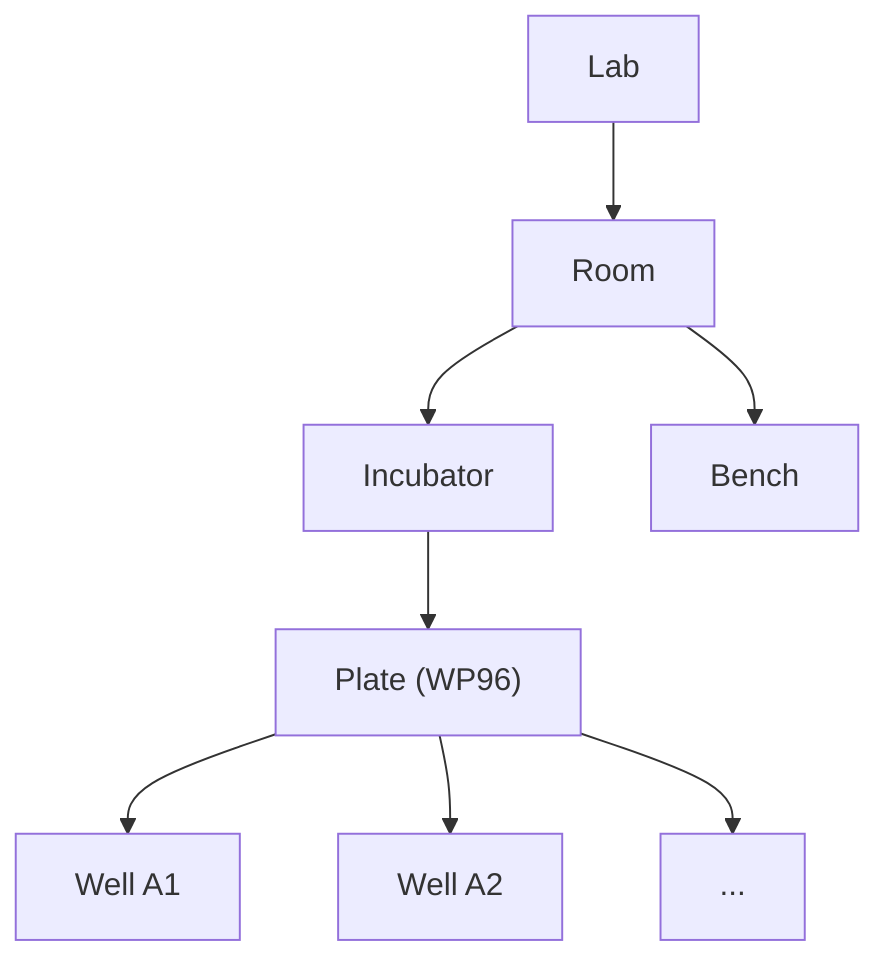

# Locations

## Recording moves, not positions

CHESS's design is inspired by how the game of chess is recorded. A chess database doesn't store
the position of every piece after every move -- it stores only the *moves themselves*, and pairs
that record with an engine that knows the rules of chess well enough to replay any game from the
start and reconstruct any position along the way. This is dramatically more compact than storing
every position, and it's robust to variants of the game (a different board size, a different
starting arrangement) because the rules, not the data format, capture what's actually allowed.

CHESS applies the same idea to a laboratory. Rather than storing "what's currently where, and
what's in it," CHESS records the primitive *operations* that change the lab --- movements,
environmental changes, transfers, and reads --- as a permanent, ordered history (the *ledger*,
covered in [The Ledger](ledger.md)), and reconstructs any state, past or
present, by replaying that history through a "lab engine." `CHESSCore` **is** that lab engine.
The rest of this chapter builds up, piece by piece, the most fundamental object in that engine:
the **location**.

## Everything is a location

Every physical thing in a lab is modeled as a *location* -- a room, a bench, an incubator, a
microwell plate, a single well inside that plate, a liquid-handling robot. If it occupies space
somewhere in the lab, it's a location.

## Locations form a hierarchy

Locations don't exist independently; they have relationships with one another. For example, a well is inside a plate, a
plate inside an incubator, and an incubator inside a room. This nesting forms a hierarchy: every
location has at most one parent, and most can have multiple children.



A location's stored relationships are exactly one level deep. Nothing anywhere records that a
well is "in" a room --- only that the well is in its plate, the plate, in turn, is in its incubator, and the
incubator is in the room. Walking up the hierarchy from the well to the room means following that chain one step
at a time. This matters because it means a location can effectively move just by virtue of its
parent moving: if the incubator gets wheeled into a different room, every plate and well inside it
moves along for free, with nothing extra to track --- just like in the real world. 


## The four location types

Not every location behaves the same way structurally. Most locations are **generic**: flexible
containers that can hold any number of other locations, and can be freely rearranged. A room, a
bench, a shelf, a freezer -- these can gain and lose children as the lab is reorganized, with no
built-in limit on what they can contain (beyond simple physical constraints, like a bench not
having infinite space).

**Labware** is different. A piece of labware -- a 96-well plate, a bottle, a tube rack -- is built
once with a permanent, fixed internal structure, for its entire existence. This distinction --
generic and freely rearrangeable vs. fixed and permanently structured -- is the first split in how
CHESS categorizes locations.

A **Well** is a third type of location. Wells are where actual material lives -- reagents, media,
samples. A Well is permanently fused to its Labware: unlike almost everything else in the lab, a
single well can never be pulled out and relocated on its own. Similarly, Labware and generic
Locations can never hold reagents -- that property is reserved specifically for Wells. Wells cannot
hold other locations either: they are terminal, sitting at the bottom of the hierarchy.

**Instruments** are a fourth, more specialized case: locations that can actively *do* things to
other locations (move them, read them, change their environment) rather than just sit there and be
acted upon.


- **[`GenericLocation`](@ref)** -- mutable, unordered membership: children can be freely added and
  removed, subject to rules covered in the next chapter, [Movement & Occupancy](movement.md).
  Examples include, rooms, benches, shelves, freezers, incubators.
- **[`Labware`](@ref)** -- a fixed, ordered grid of slots, built once at construction and never
  restructured afterward; attempting to add or remove a slot throws `FixedMembershipError`. The
  labware as a whole can still be moved freely -- it's only its own internal slots that are fixed.
  Examples include, microwell plates, bottles, tube racks.
- **[`Well`](@ref)** -- a terminal leaf: it can never have children of its own, and unlike the
  other three types, it can never be independently relocated -- it's permanently fused to its
  labware. A well is also the only place actual material is stored; see
  [Stocks & Chemistry](stocks.md).
- **[`Instrument`](@ref)** -- behaves like a `GenericLocation` for the purposes of the hierarchy,
  but is also the only one of the four that can *act on* other locations -- moving them, reading
  them, changing their environment -- rather than only ever being acted upon. 

## Location kinds

All locations fall into one of these four categories, but locations may have distinct properties. `LocationKind`s serve to differentiate specific locations from one another. For example, How is a 96-well plate different from a 384-well plate? They are both `Labware`, but they have different numbers of wells in different arrangements. Each of these plates' `LocationKind` stores the data that allows CHESS to distinguish them from each other and impart capabilities and constraints on each. 

It's worth being precise about two words that sound interchangeable but aren't: **type** and
**kind**. *Type* means one of the four concrete `Location` subtypes just covered --- the fixed set that CHESSCore operates on. These are types in the Julian sense.  A Location's *Kind* stores data and parameters. Many kinds share one type, and registering a new kind (a new plate model, a new
instrument) never adds a new type.

An earlier design of CHESS gave every specific kind of location its own concrete Julia type (a `Plate` type,
a `Rack` type, and so on), optionally arranged in a richer type hierarchy. **The current
implementation instead has exactly four concrete `Location` subtypes** --
[`GenericLocation`](@ref), [`Labware`](@ref),
[`Well`](@ref), and [`Instrument`](@ref) -- and *kind* (a 96-well plate vs. a 384-well plate vs. a
tube rack) is [`LocationKind`](@ref): a named, interned, immutable *value*, not a type.

CHESSCore provides a macro for creating new LocationKinds:

```julia
@location_kind Well200 Symbol[] nothing nothing 200u"µL" nothing nothing
@location_kind WP96 [:Plate] (8,12) :Well200 nothing "Manufacturer" "Product No."

```

These two calls create the LocationKinds `Well200` and `WP96`. The definition of WP96 has an organizational tag `:Plate` to indicate that it is a plate. Because it is a Labware, it is given an 8x12 shape that is to be filled with the `:Well200` LocationKind upon creation. It has no capacity, since that is a well property, but product information can be provided to help identify the plate. 

Every `WP96` plate anywhere in the lab shares the *same* `LocationKind` object.  Adding a new plate model never requires touching Julia's type system
at all, it just registers a new `LocationKind` value. A location's rules and capability data live as
fields directly on `LocationKind` (`categories`, `shape`, `capacity`, `vendor`/`catalog`,
`default_parent_cost`/`default_child_cost`, and, for instruments, `actuatable_attributes`/
`performable_operations`/`readable_types` -- see [Reads & Instrument Measurements](reads.md)).

The `@location_kind` macro stores new definitions in a `location_kinds` registry, so it can be looked up by name later. The collision-safe way to recall a registered kind -- without needing a fully qualified name -- is the
[`@loc_str`](@ref) string macro: `loc"WP96"`.

```julia-repl
julia> loc"WP96"
LocationKind(WP96)
```

[`concretetype(kind)`](@ref) maps a `LocationKind` to
the one Julia type that represents it: `Instrument` if it's flagged as an instrument, `Well` if it
has a `capacity`, `Labware` if it has a `shape` and `socket`, `GenericLocation` otherwise.

```julia-repl 
julia> kind(loc"WP96")
Labware 
```


!!! note 
    As a technical note on `LocationKinds`, [`@location_kind`](@ref) registers a `LocationKind` under a `const` binding in whatever module it's
    called from -- but deliberately does **not** `export` that binding (the same namespace-hygiene
    pattern used by `@attribute`/`@read`/`@chemical`/`@organism`, see
    [Registering Lab Constants](registering-lab-constants.md)): a lab module can register hundreds of
    kinds without flooding the namespace of anyone who is invoking it.


## Creating and inspecting a location

Locations are created with a single function regardless of type: [`build_location(kind,
name)`](@ref). For a `GenericLocation` this just builds the one node; for a `Labware`, it
recursively builds and fills the entire fixed well grid in the same call -- there's no separate
step where you construct the labware and then populate its wells, so there's no way to end up with
a half-built plate.

Every `Location` also has a compact one-line `Base.show` (just its name) for use in collections and
string interpolation, and a much more detailed `MIME"text/plain"` report (kind, lock/active state,
parent, children summary, attributes, and reads) for REPL inspection and `display`:

```julia-repl
julia> plate = build_location(loc"WP96", "Plate 1")
Plate 1

julia> display(plate)
Plate 1 [WP96 (Plate)]
  id: N/A   locked: false   active: true
  parent: (root)

Labware: shape (8, 12), vendor Thermo, catalog 123456

Children: 96 total, 100.0% occupied
  Well200: 96
```

!!! note 
    `id: N/A` here just means this location hasn't been committed to a database yet -- more on that in
    [Committing & Uploading](committing-uploading.md).

The next chapter, [Movement & Occupancy](movement.md), covers the mechanics of how a location
actually gets moved between parents, and the rules that keep that physically sensible.
