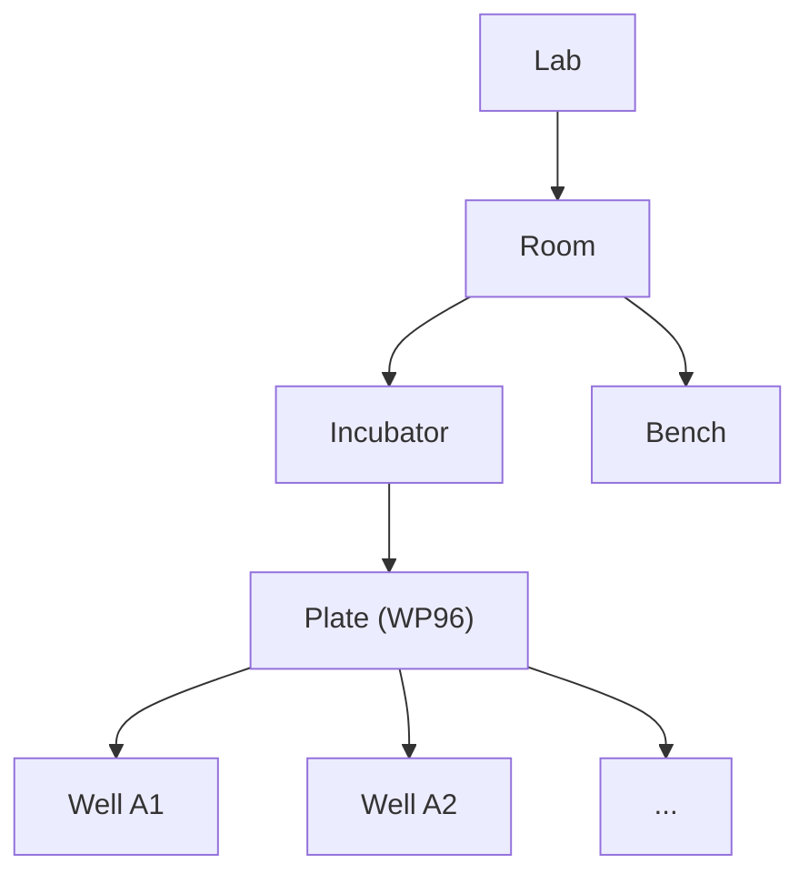

# Locations

```@meta
DocTestSetup = :(using CHESS)
```

## How CHESS records a lab

CHESS stores the primitive *operations* that change the lab (movements, environmental changes,
transfers, and reads) as a permanent, ordered history called the *ledger*, described in
[The Ledger](ledger.md). The state of the lab at any past or present time is reconstructed by
replaying that history through a lab engine, which is `CHESSCore`. This page describes the most
fundamental object in that engine, the **location**.

## What a location is

Every physical thing in a lab is modeled as a *location*: a room, a bench, an incubator, a
microwell plate, a single well inside that plate, a liquid-handling robot. Anything that occupies
space in the lab is a location.

## Location hierarchy

Locations are nested. A well is inside a plate, a plate inside an incubator, and an incubator
inside a room. This nesting forms a hierarchy: every location has at most one parent, and most can
have multiple children.


```mermaid
graph TD
    Lab[Lab] --> Room[Room]
    Room --> Incubator[Incubator]
    Room --> Bench[Bench]
    Incubator --> Plate["Plate (WP96)"]
    Plate --> WellA1[Well A1]
    Plate --> WellA2[Well A2]
    Plate --> WellDots[...]
```

A location's stored relationships are one level deep. Nothing records that a well is in a room,
only that the well is in its plate, the plate is in its incubator, and the incubator is in the
room. Finding the room from the well means following that chain one step at a time. As a result, a
location moves whenever its parent moves: if the incubator is wheeled into a different room, every
plate and well inside it moves with it, with nothing extra to record.

## The three location types

Locations come in three structural types.

- **[`GenericLocation`](@ref)**: a container with mutable, unordered membership. Children can be
  added and removed freely, subject to the rules in [Movement & Occupancy](movement.md). Examples
  are rooms, benches, shelves, freezers, and incubators.
- **[`Labware`](@ref)**: a fixed, ordered grid of slots, built once at construction and never
  restructured afterward. Adding or removing a slot throws `FixedMembershipError`. The labware as a
  whole can still be moved; only its internal slots are fixed. Examples are microwell plates,
  bottles, and tube racks.
- **[`Well`](@ref)**: a terminal leaf that never has children. A well is permanently fused to its
  labware and cannot be relocated on its own. A well is also the only place material is stored;
  see [Stocks & Chemistry](stocks.md). Labware and generic locations never hold reagents.

Some locations are also **capability-bearing**: they can act on other locations by moving them,
reading them, or changing their environment. An autoclave and a liquid-handling robot are
examples. Capability is a flag on a location's [`LocationKind`](@ref) (`is_instrument`), not a
fourth structural type. A capability-bearing location is still a `GenericLocation` or a `Labware`,
whichever its shape calls for. See [Reads & Instrument Measurements](reads.md) for instrument reads.

## Location kinds

Every location is one of the three types above, but locations of the same type can differ. A
96-well plate and a 384-well plate are both `Labware`, with different numbers of wells in different
arrangements. A [`LocationKind`](@ref) stores the data that distinguishes them and sets the
capabilities and constraints of each.

*Type* and *kind* are distinct. A *type* is one of the three concrete `Location` subtypes
([`GenericLocation`](@ref), [`Labware`](@ref), and [`Well`](@ref)), the fixed set that CHESSCore
operates on. A *kind* is a named, interned, immutable value that stores a location's data and
parameters. Many kinds share one type, and registering a new kind, such as a new plate model or
instrument, never adds a type.

The [`@location_kind`](@ref) macro creates new kinds. CHESS already includes the common ones, such
as `Room`, `Incubator`, and `WP96`, through `CHESSLabConstants`, so this example defines two new
kinds:

```jldoctest core_concepts
julia> @location_kind DemoWell Symbol[] nothing nothing 200u"µL" nothing nothing
LocationKind(DemoWell)

julia> @location_kind DemoPlate [:Plate] (8,12) :DemoWell nothing "Manufacturer" "Product No."
LocationKind(DemoPlate)
```

The positional arguments are, in order: the name, organizational categories, grid shape, the kind
that fills each slot, well capacity, vendor, and catalog number. `DemoWell` has a capacity, so it
is a well. `DemoPlate` has the category `:Plate`, an 8x12 shape filled with `DemoWell`s, and product
information in place of a capacity, since capacity is a well property.

Every plate of the same kind shares the same `LocationKind` object. A location's rules and
capability data are fields of `LocationKind`: `categories`, `shape`, `capacity`,
`vendor`/`catalog`, `default_parent_cost`/`default_child_cost`, and, for instruments,
`actuatable_attributes`/`performable_operations`/`readable_types` (see
[Reads & Instrument Measurements](reads.md)).

`@location_kind` stores the definition in the [`location_kinds`](@ref) registry, so it can be looked
up by name later, and binds a constant of the same name in the module where it runs, so this
session can refer to `DemoPlate` directly. The [`@loc_str`](@ref) string macro recalls a kind
registered by CHESS or by a lab module (see
[Registering Lab Constants](registering-lab-constants.md)) without a fully qualified name:

```jldoctest core_concepts
julia> loc"WP96"
LocationKind(WP96)
```

[`concretetype(kind)`](@ref) maps a `LocationKind` to
the Julia type that represents it: `Well` if it has a `capacity`, `Labware` if it has a `shape`,
and `GenericLocation` otherwise. Whether the kind is capability-bearing (`is_instrument`) does not
change the result.

```jldoctest core_concepts
julia> concretetype(DemoPlate)
Labware
```

!!! note
    [`@location_kind`](@ref) binds the constant in the calling module but does not `export` it. The
    same holds for `@attribute`, `@read`, `@chemical`, and `@organism` (see
    [Registering Lab Constants](registering-lab-constants.md)), so a lab module can register
    hundreds of kinds without adding names to the namespace of code that loads it.

## Creating and inspecting a location

[`build_location(kind, name)`](@ref) creates a location of any type. For a `GenericLocation` it
builds one node. For a `Labware` it builds the whole fixed well grid in the same call, so a
half-built plate cannot exist.

A `Location` prints as its name inside collections and string interpolation. The REPL and `display`
show a detailed report: kind, lock and active state, parent, a summary of children, attributes, and
reads.

```jldoctest core_concepts
julia> plate = build_location(loc"WP96", "Plate 1")
Plate 1 [WP96 (MicroPlate, WellPlate)]
  id: N/A   locked: false   active: true
  parent: (root)

Labware: shape (8, 12), vendor Thermo, catalog 123456

Children: 96 total, 100.0% occupied
  Well400: 96
```

!!! note 
    `id: N/A` means the location has not been committed to a database. See
    [Committing & Uploading](committing-uploading.md).

[Movement & Occupancy](movement.md) describes how a location is moved between parents and the
rules that govern moves.
