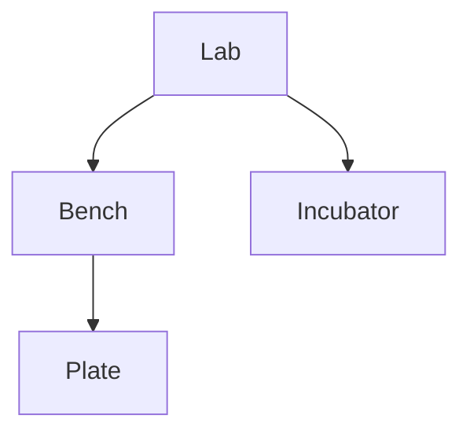
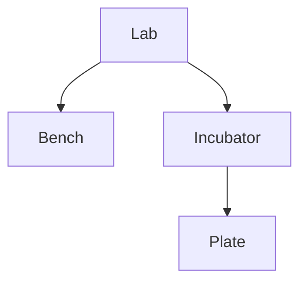

# Movement & Occupancy

[Locations](core-concepts.md) covered what a location is; this
chapter covers how Locations move within a hierarchy.

A few more `LocationKind`s, alongside the `WP96`/`Well200` plate from [Locations](core-concepts.md), are enough to give it somewhere to go.

```julia
@location_kind Lab       Symbol[] nothing nothing nothing nothing nothing 0//1 2//1
@location_kind Bench     Symbol[] nothing nothing nothing nothing nothing 0//1 0//1
@location_kind Incubator Symbol[] nothing nothing nothing nothing nothing 2//1 0//1
set_occupancy_cost!(:Incubator, :WP96, 1//4)
```

## `move_into!`

[`move_into!(parent, child)`](@ref) is how the hierarchy actually gets built and changed: it
reassigns `child`'s parent to `parent`, removing it from wherever it was before.


```julia-repl
julia> lab = build_location(loc"Lab", "Lab")
Lab

julia> bench = build_location(loc"Bench", "Bench")
Bench

julia> incubator = build_location(loc"Incubator", "Incubator")
Incubator

julia> plate = build_location(loc"WP96", "Plate 1")
Plate 1

julia> move_into!(lab, bench)

julia> move_into!(lab, incubator)

julia> move_into!(bench, plate)
```



Reading the tree back afterward is a pair of accessors: [`parent(x)`](@ref) (`nothing` if `x` is at
the root of its tree) and [`children(x)`](@ref).

```julia-repl
julia> children(lab)
2-element Vector{Location}:
 Bench
 Incubator

julia> parent(plate)
Bench
```

Over the course of an experiment, `plate` might start on `bench`, get moved into `incubator`
overnight, and then get moved again into a plate reader to be measured. Each of these is the same
kind of event: a location being moved into a new parent.

Recording the plate moving into the incubator: 

```julia-repl
julia> move_into!(incubator, plate)
```
The tree changes accordingly. 



`Bench` no longer has `Plate` as a child, `Incubator` now does, and nothing about `Lab` needed to
change -- the grandparent relationship (`Lab`/`Plate`) was never directly recorded in the first
place. A move always works this way: it changes exactly one relationship (a location's parent), and
everything nested inside that location comes along automatically.

Confirming the change directly: `bench` no longer has `plate`, `incubator` now does, and `lab`'s
own children are untouched:

```julia-repl
julia> children(bench)
Location[]

julia> children(incubator)
1-element Vector{Location}:
 Plate 1

julia> children(lab)
2-element Vector{Location}:
 Bench
 Incubator
```

## Occupancy and locking

Every `move_into!` call above succeeded, but not every move is allowed. `move_into!` is gated by
[`can_move_into(parent, child)`](@ref), which can refuse a move for a few distinct reasons:

- [`LockedLocationError`](@ref) -- `child` is [`is_locked`](@ref).
- [`AlreadyLocatedInError`](@ref) -- `child` is already inside `parent`.
- [`OccupancyError`](@ref) -- the move would over-fill `parent`.
- [`FixedMembershipError`](@ref) -- `parent`'s slots are structurally fixed (`Labware`/`Well`), or
  `child` is a `Well` (permanently fused to its `Labware`, per the generic-vs-fixed distinction from
  [Locations](core-concepts.md)).

**Occupancy.** A location's [`occupancy`](@ref) is a rational number from `0` to `1` describing how
full it is, and every `(parent kind, child kind)` pair has an [`occupancy_cost`](@ref) describing
how much of the parent's capacity one instance of that child consumes. `move_into!` refuses any move
that would push `occupancy(parent) + occupancy_cost(parent, child)` above `1`. Register a cost with
[`set_occupancy_cost!`](@ref) -- this is exactly the rule registered at the top of this chapter,
letting an Incubator hold up to four plates:

```julia
set_occupancy_cost!(:Incubator, :WP96, 1//4) # an Incubator holds up to four plates
```

Occupancy costs are stored as `Rational`s specifically to avoid floating-point rounding ever
producing a spuriously-over-full or spuriously-under-full location. An occupancy cost greater than
`1` unconditionally blocks a movement regardless of current occupancy, which is how
physically-impossible pairings (a bench into a well) get rejected outright rather than merely
"usually" rejected. Costs default to `0` unless a kind's `@location_kind` declaration sets
`default_parent_cost`/`default_child_cost`, or an exact/category-based rule is registered via
`set_occupancy_cost!`.

`Labware` and `Well` are the exception: `occupancy` is always `1//1`, regardless
of how many of a `Labware`'s wells actually hold anything. Their slots are structurally fixed --
either fully built at construction or not present at all -- so there's no partial-membership state
to compute, unlike `GenericLocation`/`Instrument`, whose occupancy is always derived from
`occupancy_cost`.

**Locking and activity.** Two other pieces of per-location state: [`is_locked`](@ref) (can this
location itself be moved out of its current parent right now? -- children of a locked location can
still be moved) and [`is_active`](@ref) (a general on/off flag), toggled with
`lock!`/`unlock!`/`toggle_lock!` and `activate!`/`deactivate!`/`toggle_activity!`.

```julia-repl
julia> lock!(plate)

julia> move_into!(bench, plate)
ERROR: LockedLocationError: Plate 1 is locked
```

## Checking a move before making it

`can_move_into` never returns `false` -- it either returns `true` or throws one of the four errors
above. "Checking" whether a move would succeed without performing it means calling `can_move_into`
directly and catching whatever it throws, rather than branching on a boolean:

```julia-repl
julia> try
           can_move_into(bench, plate)
       catch e
           println("can't move: ", e)
       end
```

## Detaching a location

Moving a location out of the hierarchy entirely -- with no new parent -- is `move_into!(nothing,
child)`:

```julia-repl
julia> unlock!(plate)

julia> move_into!(nothing, plate)

julia> parent(plate) === nothing
true
```

The next chapter, [Environmental Attributes & Inheritance](attributes.md), covers what else a
location carries besides its position: its environment.

