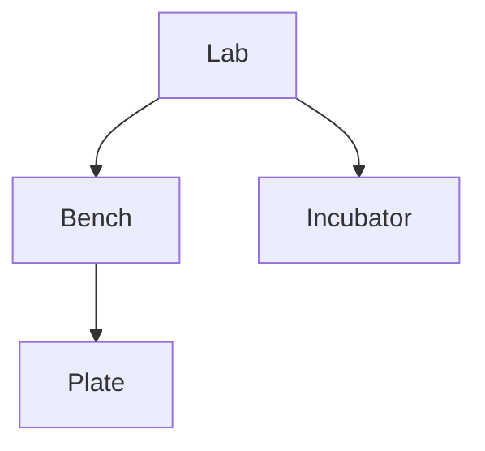
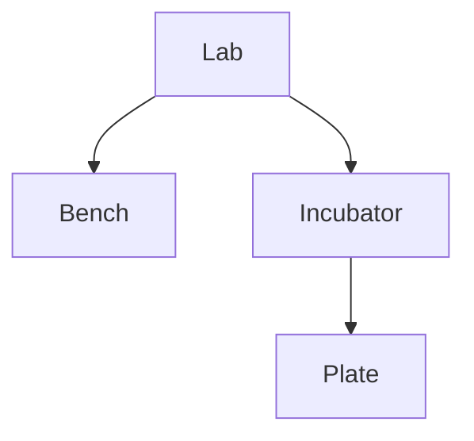

# Movement & Occupancy

```@meta
DocTestSetup = :(using CHESS)
```

This page describes how [locations](core-concepts.md) move within a hierarchy.

CHESS already includes the location kinds `Lab`, `Bench`, and `WP96`. Its `Incubator` kind has
shelves, so this page defines a simpler incubator that holds up to four plates directly:

```jldoctest movement
julia> @location_kind SmallIncubator Symbol[] nothing nothing nothing nothing nothing 2//1 0//1
LocationKind(SmallIncubator)

julia> set_occupancy_cost!(:SmallIncubator, :WP96, 1//4)
```

## `move_into!`

[`move_into!(parent, child)`](@ref) builds and changes the hierarchy. It reassigns `child`'s parent
to `parent`, removing it from its previous parent.

```jldoctest movement
julia> lab = build_location(loc"Lab", "Lab");

julia> bench = build_location(loc"Bench", "Bench");

julia> incubator = build_location(SmallIncubator, "Incubator");

julia> plate = build_location(loc"WP96", "Plate 1");

julia> move_into!(lab, bench)

julia> move_into!(lab, incubator)

julia> move_into!(bench, plate)
```


```mermaid
graph TD
    Lab[Lab] --> Bench[Bench]
    Lab[Lab] --> Incubator[Incubator]
    Bench[Bench] --> Plate[Plate]
```

[`parent(x)`](@ref parent) returns the parent of `x`, or `nothing` if `x` is at the root of its
tree. [`children(x)`](@ref children) returns its children.

```jldoctest movement
julia> children(lab)
2-element Vector{Location}:
 Bench
 Incubator

julia> print(parent(plate))
Bench
```

Over an experiment, a plate might start on a bench, move into an incubator overnight, and then move
into a plate reader to be measured. Each is the same kind of event: a location moving into a new
parent.

Moving the plate into the incubator:

```jldoctest movement
julia> move_into!(incubator, plate)
```

The tree changes accordingly.


```mermaid
graph TD
    Lab2[Lab] --> Bench2[Bench]
    Lab2 --> Incubator2[Incubator]
    Incubator2 --> Plate2[Plate]
```

`Bench` no longer has `Plate` as a child and `Incubator` does. `Lab` does not change, because the
`Lab`/`Plate` relationship was never recorded. A move changes exactly one relationship, a
location's parent, and everything nested inside that location moves with it.

The children confirm the change: `bench` has no children, `incubator` has `plate`, and `lab`'s
children are unchanged:

```jldoctest movement
julia> children(bench)
Location[]

julia> children(incubator)
1-element Vector{Location}:
 Plate 1

julia> children(lab)
2-element Vector{Location}:
 Bench
 Incubator
```

## Occupancy and locking

Not every move is allowed. `move_into!` calls [`can_move_into(parent, child)`](@ref), which
refuses a move for one of these reasons:

- [`LockedLocationError`](@ref): `child` is [`is_locked`](@ref).
- [`AlreadyLocatedInError`](@ref): `child` is already inside `parent`.
- [`OccupancyError`](@ref): the move would over-fill `parent`.
- [`FixedMembershipError`](@ref): `parent`'s slots are fixed (`Labware` or `Well`), or `child` is a
  `Well`, which is permanently fused to its `Labware` (see [Locations](core-concepts.md)).

**Occupancy.** A location's [`occupancy`](@ref) is a rational number from 0 to 1 describing how
full it is. Every `(parent kind, child kind)` pair has an [`occupancy_cost`](@ref), the fraction of
the parent's capacity that one instance of the child consumes. `move_into!` refuses any move that
would push the parent's occupancy plus that cost above 1. [`set_occupancy_cost!`](@ref)
registers a cost. This is the rule registered at the top of this page, which lets the incubator hold
up to four plates:

```julia
set_occupancy_cost!(:SmallIncubator, :WP96, 1//4) # holds up to four plates
```

Costs are rational numbers so that floating-point rounding cannot make a location appear over-full or
under-full. A cost greater than 1 blocks the move whatever the current occupancy, which rejects
physically impossible pairings such as a bench into a well. A cost defaults to zero unless the
kind's `@location_kind` declaration sets `default_parent_cost`/`default_child_cost`, or an exact or
category-based rule is registered with `set_occupancy_cost!`.

The occupancy of a `Labware` or `Well` is always 1 (full), however many of its wells hold material.
Their slots are fixed at construction, so no partial occupancy exists. The occupancy of a
`GenericLocation` is derived from `occupancy_cost`.

**Locking and activity.** [`is_locked`](@ref) says whether a location can be moved out of its
current parent. Children of a locked location can still be moved. [`is_active`](@ref) is a general
on/off flag. `lock!`, `unlock!`, and `toggle_lock!` change the lock, and `activate!`,
`deactivate!`, and `toggle_activity!` change the active flag.

```jldoctest movement
julia> lock!(plate);

julia> move_into!(bench, plate)
ERROR: Locked Location Error with: Plate 1
```

## Checking a move before making it

`can_move_into` never returns false. It returns true or throws one of the four errors above. To
check a move without performing it, call `can_move_into` and catch the error:

```jldoctest movement
julia> try
           can_move_into(bench, plate)
       catch e
           println("can't move: ", e)
       end
can't move: LockedLocationError(Plate 1)
```

## Detaching a location

`move_into!(nothing, child)` removes a location from the hierarchy, leaving it with no parent:

```jldoctest movement
julia> unlock!(plate);

julia> move_into!(nothing, plate)

julia> parent(plate) === nothing
true
```

[Environmental Attributes & Inheritance](attributes.md) describes the environment a location
carries in addition to its place in the hierarchy.

